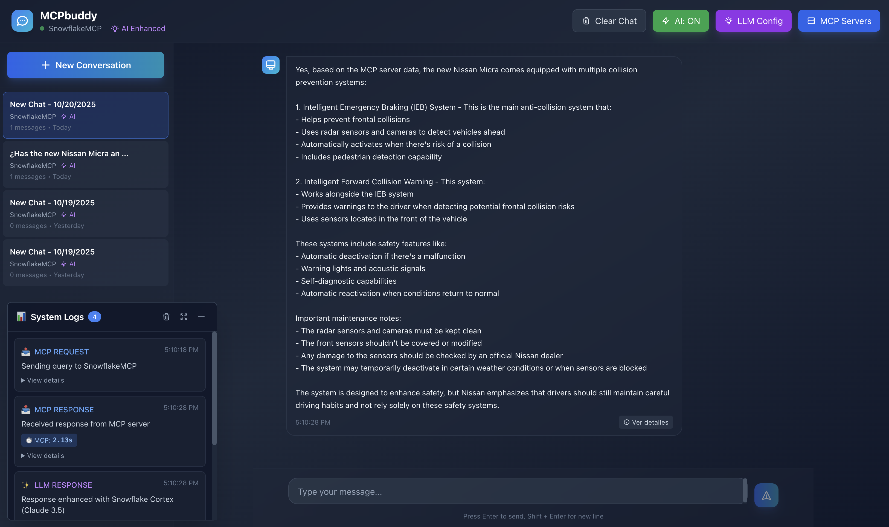
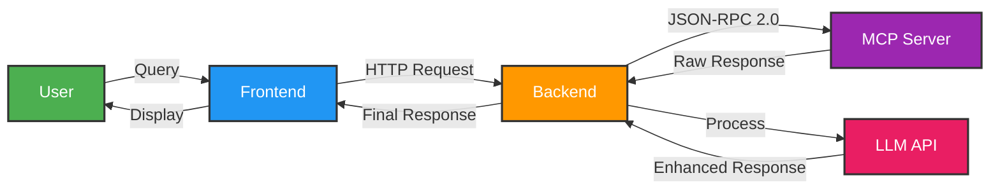

<div align="center">

# 🤖 MCPbuddy

### *Your intelligent companion for MCP servers with AI-powered enhancements*

[](https://nodejs.org/)
[](https://react.dev/)
[](https://www.typescriptlang.org/)
[](LICENSE)

**A modern, elegant interface to manage and interact with MCP (Model Context Protocol) servers**

[🚀 Quick Start](#-quick-start) • [⚙️ Configuration](#️-configuration) • [✨ Features](#-features) • [📚 Documentation](#-documentation)

</div>

---

## 📸 Preview

<div align="center">
  
  <p><i>Modern chat interface with MCP server management and AI enhancement</i></p>
</div>

---

## 📋 Table of Contents

- [🚀 Quick Start](#-quick-start)
- [⚙️ Configuration](#️-configuration)
- [✨ Features](#-features)
- [🏗️ Architecture](#️-architecture)
- [🛠️ Tech Stack](#️-tech-stack)
- [📄 License](#-license)

---

## 🚀 Quick Start

Get MCPbuddy up and running in less than 5 minutes!

### Prerequisites

Before you begin, ensure you have:

- 🟢 **Node.js 18+** installed ([Download](https://nodejs.org/))
- 📦 **npm** (comes with Node.js)
- 🔌 An MCP server endpoint (e.g., Snowflake MCP Server)

### Installation

```bash
# 1. Clone the repository
git clone https://github.com/M3l3r0/MCP-buddy.git
cd MCP-buddy

# 2. Install dependencies
npm install

# 3. Start the application
npm run dev
```

### Access the Application

Once started, open your browser:

- 🌐 **Frontend**: http://localhost:3000
- 🔧 **Backend API**: http://localhost:3001

That's it! You're ready to configure your first MCP server. 🎉

---

## ⚙️ Configuration

### 🔌 Step 1: Add Your First MCP Server

**Option A: Using the UI (Recommended)**

1. Click **"⚙️ Servers"** in the header
2. Click **"+ Add Server"**
3. Fill in your server details:

**Example: Snowflake MCP Server**
```
Name: My Snowflake Server
Server URL: https://your-account.snowflakecomputing.com/api/v2/databases/DB/schemas/SCHEMA/mcp-servers/your_server
Auth Method: Bearer Token
Bearer Token: [your-jwt-token]
```

**Example: API Key Authentication**
```
Name: My Custom API
Server URL: https://api.example.com/mcp
Auth Method: API Key
API Key: [your-api-key]
Header Name: X-API-Key
```

4. Click **"Add Server"**
5. Your configuration is automatically saved in browser localStorage

**Option B: Configuration File (For Developers)**

```bash
# Create a local config file
cp config.local.json.example public/config.local.json

# Edit with your credentials (this file is git-ignored)
```

> 📖 See complete examples in [CONFIG_EXAMPLE.md](docs/CONFIG_EXAMPLE.md)

---

### 🤖 Step 2: Configure AI Enhancement (Optional)

Enhance raw MCP responses with natural language using LLMs.

1. Click **"🤖 LLM Config"** in the header
2. Click **"+ Add LLM Config"**
3. Choose your provider and configure:

**Example: Snowflake Cortex**
```
Name: Snowflake Claude
Provider: ❄️ Snowflake Cortex
Model: claude-3-5-sonnet
API Key: [your-snowflake-jwt-token]
Endpoint: https://your-account.snowflakecomputing.com/api/v2/cortex/inference:complete
Temperature: 0.7
Max Tokens: 2000
```

**Example: OpenAI**
```
Name: GPT-4
Provider: 🤖 OpenAI
Model: gpt-4
API Key: sk-...
Endpoint: https://api.openai.com/v1/chat/completions
```

**Example: Local LLM (Ollama)**
```
Name: Local Llama
Provider: 🦙 Ollama
Model: llama3
Endpoint: http://localhost:11434/api/chat
```

4. Click **"Add Config"**
5. Toggle the AI button in the header to **"AI: ON"** (green)

> 📖 More examples: [CONFIG_EXAMPLE.md](docs/CONFIG_EXAMPLE.md) | [LOCAL_CONFIG.md](docs/LOCAL_CONFIG.md)

---

### 🔒 Security Best Practices

> ⚠️ **IMPORTANT**: MCPbuddy does NOT include hardcoded credentials.

- ✅ All configurations are stored in **browser localStorage**
- ✅ **NO** credentials are committed to the repository
- ✅ Sensitive files are git-ignored (`.env`, `*credentials*`, `*.key`, `*-local.json`)
- ✅ Each user configures their own endpoints and tokens

**Never share your tokens, API keys, or endpoints in issues or PRs!** 🔐

See [SECURITY.md](docs/SECURITY.md) for more information.

---

## ✨ Features

### 🎯 Core Capabilities

| Feature | Description |
|---------|-------------|
| 💬 **Interactive Chat** | Modern messenger-like interface with message bubbles and auto-scroll |
| 🔌 **Multi-Server MCP** | Connect and manage multiple MCP servers simultaneously |
| 🤖 **AI Enhancement** | Transform raw MCP responses into natural language with LLMs |
| 🔄 **JSON-RPC 2.0** | Standard protocol communication with MCP servers |
| 💾 **Local Persistence** | All configurations saved securely in browser storage |

### 🧠 LLM Support

MCPbuddy works with all major LLM providers:

| Provider | Models | Status |
|----------|--------|--------|
| ❄️ **Snowflake Cortex** | llama3-70b, llama3.1-405b, mistral-large2, mixtral-8x7b, claude-3-5-sonnet | ✅ Supported |
| 🤖 **OpenAI** | GPT-4, GPT-4-turbo, GPT-3.5-turbo | ✅ Supported |
| 🧠 **Anthropic** | Claude 3 Opus, Claude 3 Sonnet, Claude 3 Haiku | ✅ Supported |
| 🦙 **Ollama** | llama3, mistral, codellama, and more | ✅ Supported |
| 🔮 **LM Studio** | Any local model | ✅ Supported |
| ⚙️ **Custom APIs** | OpenAI-compatible endpoints | ✅ Supported |

### 🎨 Modern UI/UX

- 🌙 **Dark Theme** - Elegant design with gradients and glassmorphism effects
- 📱 **Fully Responsive** - Works seamlessly on desktop, tablet, and mobile
- ⚡ **Hot Reload** - Fast development with Vite HMR
- 🎭 **Smooth Animations** - Fluid transitions and visual feedback
- 🔔 **Live Status Indicators** - Loading states, errors, and connection status
- 📊 **Real-time Logs Panel** - Monitor MCP messages and response times
- ⏱️ **Performance Metrics** - Detailed timing breakdown (MCP, LLM, Total)
- 🔍 **Technical Details** - Inspect full requests/responses in messages

### 🔐 Authentication Methods

- 🎫 **Bearer Token** - JWT or OAuth tokens
- 🔑 **API Key** - Custom header authentication
- 👤 **Basic Auth** - Username/password
- 🔓 **OAuth 2.0** - Full OAuth flow
- ⚙️ **Custom Auth** - Flexible custom headers

---

## 📖 How to Use

### 1️⃣ Select an MCP Server

- Servers appear in the left panel
- Click on a server to activate it
- Active server shows green indicator 🟢 in header

### 2️⃣ Toggle AI Enhancement

- **AI: ON** (green) - Responses enhanced by LLM with natural language
- **AI: OFF** (gray) - Raw responses directly from MCP server

### 3️⃣ Start Chatting

1. Type your question in the text field
2. Press **Enter** or click send ➤
3. The system will:
   - 📡 Query the MCP Server using JSON-RPC 2.0
   - 🔧 List available tools (`tools/list`)
   - 🎯 Execute the appropriate tool (`tools/call`)
   - 🤖 (If AI is ON) Enhance response with LLM
   - 💬 Display the answer in chat

### 4️⃣ Manage Conversations

- **Clear Chat** - Reset current conversation history
- **Conversations Sidebar** - Browse past chats
- Context maintained per server (up to 20 messages)

---

## 🏗️ Architecture

```
┌──────────────────┐
│  React Frontend  │  (Port 3000)
│   TypeScript     │  Chat UI, Server Manager, Config
└────────┬─────────┘
         │ HTTP/JSON
         ▼
┌──────────────────┐
│  Express Server  │  (Port 3001)
│     Node.js      │  Proxy, Request Handler
└────────┬─────────┘
         │
    ┌────┴────┐
    │         │
    ▼         ▼
┌──────────┐ ┌──────────┐
│   MCP    │ │   LLM    │
│  Server  │ │ Provider │
│ (Queries)│ │(Enhance) │
└──────────┘ └──────────┘
```

### Request Flow (with AI Enhancement)



**Key Components:**

- **Frontend (React + TypeScript)**: Chat interface, server management, LLM configuration
- **Backend (Express)**: Proxy server, handles CORS, processes MCP/LLM requests
- **MCP Server**: Executes queries via JSON-RPC 2.0 protocol
- **LLM Provider**: Enhances responses with natural language processing

---

## 🛠️ Tech Stack

### Frontend

| Technology | Purpose |
|-----------|---------|
| ⚛️ React 18 | UI framework |
| 📘 TypeScript | Type safety |
| 🎨 Tailwind CSS | Utility-first styling |
| ⚡ Vite | Build tool & dev server |
| 🔌 Axios | HTTP client |

### Backend

| Technology | Purpose |
|-----------|---------|
| 🟢 Node.js 18+ | Runtime environment |
| 🚂 Express | Web framework |
| 🔌 Axios | HTTP client |
| 🔄 JSON-RPC 2.0 | MCP protocol |

### Additional Features

- 💾 **LocalStorage API** - Configuration persistence
- 🔐 **Multiple Auth Methods** - Bearer, API Key, OAuth, Basic, Custom
- 🌊 **Server-Sent Events (SSE)** - LLM response streaming
- 🎭 **Glassmorphism Design** - Modern UI aesthetic

---

## 📁 Project Structure

```
mcp-buddy/
├── 📂 src/                      # React frontend
│   ├── 📂 components/           # React components
│   │   ├── Chat.tsx            # Main chat interface
│   │   ├── Header.tsx          # Top navigation bar
│   │   ├── MessageBubble.tsx   # Chat message bubbles
│   │   ├── ServerManager.tsx   # MCP server management
│   │   ├── LLMConfigManager.tsx # LLM configuration
│   │   ├── ConversationsSidebar.tsx # Chat history
│   │   └── LogsPanel.tsx       # Real-time logs
│   ├── types.ts                # TypeScript types
│   ├── App.tsx                 # Root component
│   ├── main.tsx                # Entry point
│   └── index.css               # Global styles
│
├── 📂 server/                   # Express backend
│   └── index.js                # API server
│
├── 📂 public/                   # Static assets
│   └── config.local.json       # Local config (git-ignored)
│
├── 📄 package.json             # Dependencies
├── 📄 vite.config.js           # Vite configuration
├── 📄 tailwind.config.js       # Tailwind setup
├── 📄 tsconfig.json            # TypeScript config
└── 📄 README.md                # This file
```

---

## 🔧 Development

### Available Scripts

```bash
# Run both frontend and backend concurrently
npm run dev

# Run frontend only (Vite dev server)
npm run dev:client

# Run backend only (Express server)
npm run dev:server

# Build for production
npm run build

# Preview production build
npm run preview
```

### Environment Variables (Optional)

Create a `.env` file in the project root:

```env
# Frontend port
VITE_PORT=3000

# Backend port
SERVER_PORT=3001
```

### Development Tips

- 🔥 Hot reload enabled for fast development
- 🧪 Test with local LLMs using Ollama for free
- 📊 Use the Logs Panel to debug MCP/LLM communication
- 🔍 Click "View Details" on messages to inspect full request/response

---

## 🐛 Troubleshooting

<details>
<summary><b>❌ Server not responding (404/405 error)</b></summary>

**Solutions:**
- Verify server URL is correct
- Check that Bearer token/API key is valid and not expired
- Ensure MCP server is active and accessible
- Check server logs for specific error messages
</details>

<details>
<summary><b>❌ LLM not enhancing responses</b></summary>

**Solutions:**
1. Verify **"AI: ON"** button is green in header
2. Check that you have an LLM configured in "LLM Config"
3. Review backend terminal for error logs
4. Verify LLM token/API key is valid
5. Test LLM endpoint independently (e.g., with curl)
</details>

<details>
<summary><b>❌ CORS errors in browser</b></summary>

**Solutions:**
- Ensure both frontend (port 3000) and backend (port 3001) are running
- Backend acts as proxy to prevent CORS issues
- Check proxy configuration in `vite.config.js`
- Restart both servers with `npm run dev`
</details>

<details>
<summary><b>❌ Garbled LLM responses</b></summary>

**Solutions:**
- This issue is fixed in the latest version
- Backend automatically parses SSE format from Snowflake Cortex
- Update to the latest code from the repository
</details>

---

## 📄 License

This project is licensed under the **MIT License** - see the [LICENSE](LICENSE) file for details.

---

## 👨‍💻 Author

**Ignacio Melero**  
📧 ignacio.melero@snowflake.com  
🐙 GitHub: [@M3l3r0](https://github.com/M3l3r0)

---

## 🙏 Acknowledgments

Special thanks to:

- 🧠 [Anthropic](https://www.anthropic.com/) - For creating the MCP protocol
- ❄️ [Snowflake](https://www.snowflake.com/) - For Snowflake Cortex AI
- ⚡ [Vite Team](https://vitejs.dev/) - For the blazing fast build tool
- ⚛️ [React Team](https://react.dev/) - For the amazing UI framework
- 🌟 The open source community

---

## 📚 Documentation

### Additional Resources

- 📖 [Model Context Protocol Docs](https://modelcontextprotocol.io/)
- ❄️ [Snowflake Cortex REST API](https://docs.snowflake.com/en/user-guide/snowflake-cortex/cortex-rest-api)
- 🤖 [OpenAI API Reference](https://platform.openai.com/docs/api-reference)
- 🧠 [Anthropic API Reference](https://docs.anthropic.com/claude/reference)
- 🦙 [Ollama Documentation](https://ollama.ai/docs)

### Project Documentation

- 📋 [Configuration Examples](docs/CONFIG_EXAMPLE.md)
- 🔧 [Local Development Setup](docs/LOCAL_CONFIG.md)
- 🚀 [Quick Start Guide](docs/QUICKSTART.md)
- 📝 [Changelog](CHANGELOG.md)
- 🔒 [Security Policy](docs/SECURITY.md)

---

<div align="center">

### ⭐ Star this project if you find it useful! ⭐

[](https://github.com/M3l3r0/MCP-buddy/stargazers)
[](https://github.com/M3l3r0/MCP-buddy/network/members)

[🐛 Report Bug](https://github.com/M3l3r0/MCP-buddy/issues) • [✨ Request Feature](https://github.com/M3l3r0/MCP-buddy/issues) • [📖 Documentation](https://github.com/M3l3r0/MCP-buddy/wiki)

---

Made with ❤️ and ☕ by the MCPbuddy team

</div>
